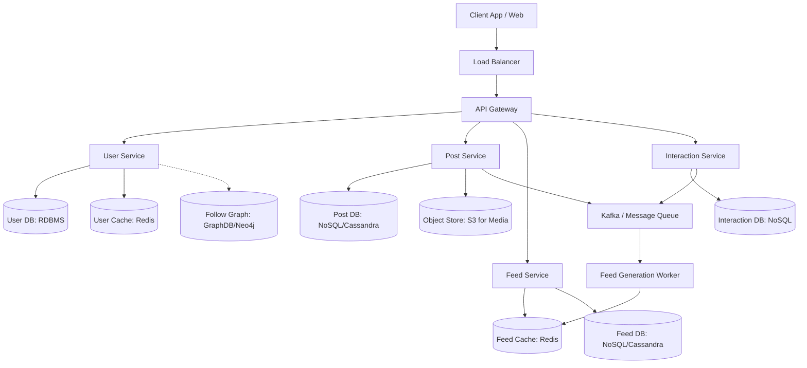
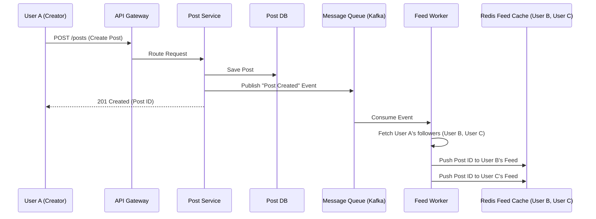
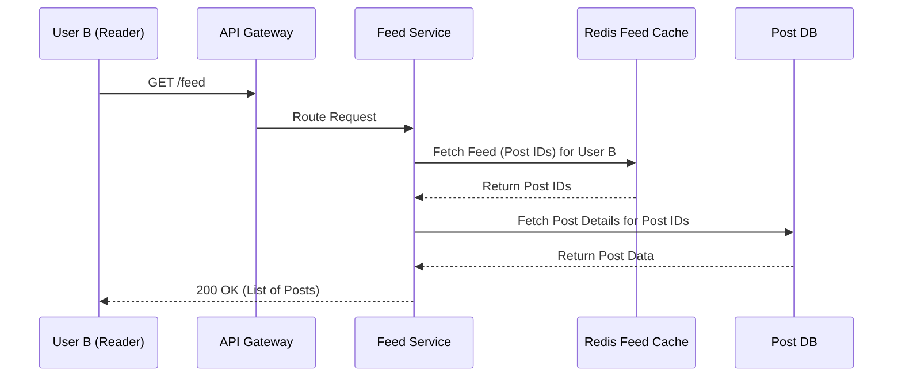

# High-Level Design (HLD) Document - News Feed System

## 1. System Architecture Diagram

## 2. Component Descriptions and Responsibilities

- **Client App / Web**: The user interface where users interact with the platform (view feeds, create posts, like/comment).
- **Load Balancer**: Distributes incoming traffic across multiple API Gateways to ensure high availability.
- **API Gateway**: Acts as the single entry point. Handles authentication, rate limiting, request routing, and basic validation.
- **User Service**: Manages user registration, authentication, profiles, and relationships (followers/following).
- **Post Service**: Handles content creation (text, images, videos), editing, and deletion. It also uploads media to the Object Store and publishes post events to a message queue.
- **Feed Service**: Responsible for generating, caching, and serving personalized news feeds for users.
- **Interaction Service**: Manages likes, comments, and shares, as well as tracking engagement metrics.
- **Feed Generation Worker**: Consumes events from the Message Queue (e.g., new post created) and asynchronously updates the feed caches of the user's followers.

## 3. Database Schema Design

### User Database (SQL - e.g., PostgreSQL or MySQL)
Used for structured data requiring strong consistency.

- **Users Table**
  - `user_id` (PK)
  - `username`
  - `email`
  - `password_hash`
  - `created_at`
  - `profile_picture_url`

### Follow Graph / Relationship (Graph DB or RDBMS)
- **Followers Table**
  - `follower_id` (FK -> Users)
  - `followee_id` (FK -> Users)
  - `created_at`
  - *Primary Key: (follower_id, followee_id)*

### Post Database (NoSQL - e.g., Cassandra or MongoDB)
Used for high write throughput and scalability.

- **Posts Collection**
  - `post_id` (PK)
  - `user_id` (Indexed)
  - `content_text`
  - `media_urls` (List of URLs)
  - `created_at`
  - `likes_count`
  - `comments_count`

### Feed Database (NoSQL or In-Memory Cache)
Stores pre-computed feeds for users.

- **Feeds Collection**
  - `user_id` (PK)
  - `post_ids` (List of recent post IDs)

### Interaction Database (NoSQL)
- **Likes Collection**
  - `like_id` (PK)
  - `post_id` (Indexed)
  - `user_id`
  - `created_at`
- **Comments Collection**
  - `comment_id` (PK)
  - `post_id` (Indexed)
  - `user_id`
  - `text`
  - `created_at`

## 4. API Endpoint Definitions

### User Management
- `POST /api/v1/users/register`: Register a new user.
- `POST /api/v1/users/login`: Authenticate and return a token.
- `GET /api/v1/users/{user_id}`: Get user profile.
- `POST /api/v1/users/{user_id}/follow`: Follow a user.
- `DELETE /api/v1/users/{user_id}/follow`: Unfollow a user.

### Post Management
- `POST /api/v1/posts`: Create a new post. (Body: text, media_urls)
- `GET /api/v1/posts/{post_id}`: Retrieve a specific post.
- `DELETE /api/v1/posts/{post_id}`: Delete a post.

### Feed Generation
- `GET /api/v1/feed`: Get the personalized feed for the authenticated user (supports pagination parameters `cursor` and `limit`).

### Engagement
- `POST /api/v1/posts/{post_id}/like`: Like a post.
- `DELETE /api/v1/posts/{post_id}/like`: Unlike a post.
- `POST /api/v1/posts/{post_id}/comments`: Add a comment.

## 5. Data Flow Diagrams

### Feed Generation Flow (Fanout-on-Write / Push Model)

### Feed Retrieval Flow

## 6. Design Decisions and Trade-off Analysis

### Feed Generation Strategy
**Decision: Hybrid Approach (Push for regular users, Pull for celebrities)**

- **Fanout-on-write (Push Model)**: When a normal user creates a post, the ID is immediately pushed to all their followers' feed caches.
  - *Pros*: Very fast reads (O(1)).
  - *Cons*: High write overhead for users with many followers.
- **Fanout-on-read (Pull Model)**: Feeds are generated on-the-fly when a user requests it by querying all followed users' recent posts.
  - *Pros*: No write amplification.
  - *Cons*: Slow reads, especially if a user follows thousands of people.

**Hybrid Strategy Justification**:
For standard users (e.g., < 10,000 followers), we use the push model. For "celebrities" (e.g., > 10,000 followers), we do not push their posts to all followers. Instead, when a follower requests their feed, the system pulls posts from the celebrity and merges them with the user's pre-computed (pushed) feed in real-time. This avoids the massive write amplification associated with a celebrity posting, while maintaining fast feed load times for the vast majority of regular interactions.

### Database Choice
**Decision: Polyglot Persistence**
- We use a Relational DB (like PostgreSQL) for User data because it requires strong ACID properties and relationships are well-defined.
- We use a NoSQL Wide-Column Store (like Cassandra) for Posts and Feeds because we need massive write scalability, horizontal scaling, and eventual consistency is acceptable. Cassandra's partition key (e.g., `user_id`) allows for efficient retrieval of a user's feed or post history.
