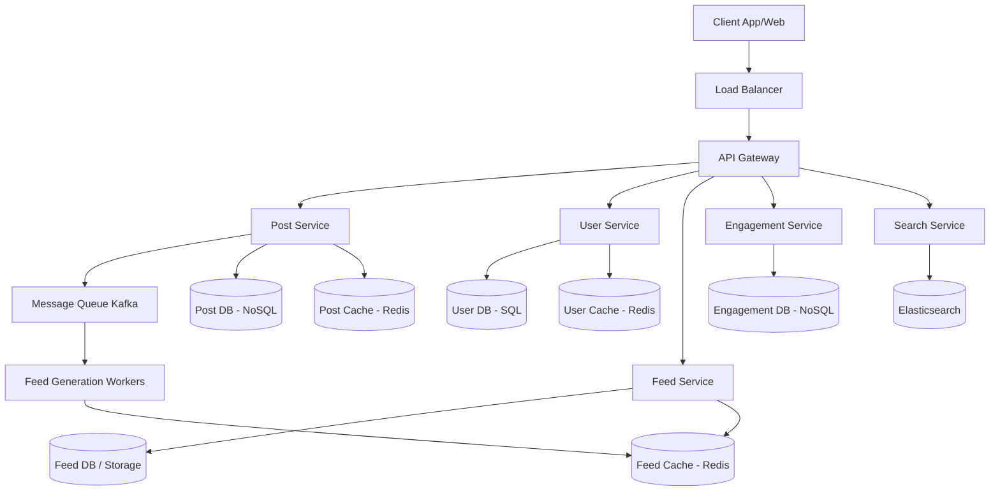

# High-Level Design (HLD): News Feed System

This document outlines the high-level architecture and design of a highly scalable News Feed System.

## 1. System Architecture Diagram

*(Note: If viewing this markdown offline, imagine a standard microservices architecture with an API gateway, distinct services for posts, users, feed, and engagement, all backed by appropriate databases, caches, and connected via Kafka for asynchronous processing).*

## 2. Component Descriptions

- **API Gateway**: Entry point for all clients. Handles rate limiting, authentication, and request routing.
- **User Service**: Manages user profiles, authentication, and relationships (followers/following).
- **Post Service**: Handles post creation, editing, deletion, and media metadata.
- **Feed Service**: Responsible for generating, retrieving, and paginating the user's news feed.
- **Engagement Service**: Handles likes, comments, and shares.
- **Search Service**: Indexes users and posts using Elasticsearch for full-text search.
- **Message Queue (Kafka)**: Decouples post creation from feed generation (fanout process).
- **Feed Generation Workers**: Consume events from Kafka to pre-compute and update user feeds in the cache.

## 3. Feed Generation Strategy

### Comparison

1. **Fanout-on-write (Push Model)**:
   - *How it works*: When a user creates a post, it is immediately pushed (written) to the feed caches of all their followers.
   - *Pros*: Very fast reads (feeds are pre-computed).
   - *Cons*: Write-heavy. Terrible for "celebrity" users (millions of followers) because a single post triggers millions of cache writes (the "thundering herd" problem).
2. **Fanout-on-read (Pull Model)**:
   - *How it works*: Feeds are not pre-computed. When a user requests their feed, the system fetches recent posts from all the people they follow, merges them, and sorts them.
   - *Pros*: Very cheap writes. No thundering herd problem for celebrities.
   - *Cons*: Slow reads. The computation is heavy and must happen in real-time when the user loads the app.

### Chosen Strategy: Hybrid Approach

We will use a **Hybrid Approach** to balance the trade-offs:
- **For regular users (active, few followers)**: We use **Fanout-on-write**. Their posts are pushed to their followers' feed caches.
- **For celebrities (many followers, e.g., > 100k)**: We use **Fanout-on-read**. We do *not* push their posts to followers' caches.
- **When generating a user's feed**: The system retrieves the user's pre-computed feed (which contains posts from regular users) and then pulls the recent posts from any celebrities they follow. It merges, sorts, and returns the combined result.

This ensures reads are mostly fast, and writes never cause a massive bottleneck.

## 4. Database Schema Design

### 4.1. User DB (SQL - e.g., PostgreSQL)
SQL is chosen for users to handle ACID properties around user credentials and structured profile data.

**Table: `Users`**
- `user_id` (PK, UUID)
- `username` (VARCHAR)
- `email` (VARCHAR)
- `password_hash` (VARCHAR)
- `is_celebrity` (BOOLEAN)
- `created_at` (TIMESTAMP)

**Table: `User_Relationships`**
- `follower_id` (UUID, FK -> Users)
- `following_id` (UUID, FK -> Users)
- `created_at` (TIMESTAMP)
- *Primary Key: (follower_id, following_id)*
- *Index on following_id to get followers quickly.*

### 4.2. Post DB (NoSQL - e.g., Cassandra / DynamoDB)
NoSQL is chosen for massive scale and write-heavy workloads.

**Table: `Posts`**
- `post_id` (PK, UUID/Snowflake)
- `user_id` (Partition Key, UUID)
- `content` (TEXT)
- `media_urls` (LIST<String>)
- `created_at` (Sort Key, TIMESTAMP)

### 4.3. Engagement DB (NoSQL - e.g., Cassandra)

**Table: `Likes`**
- `post_id` (Partition Key)
- `user_id` (Sort Key)
- `created_at` (TIMESTAMP)

## 5. API Endpoint Definitions

All endpoints assume a Bearer token is passed in the `Authorization` header.

### User Service
- `POST /api/v1/users/register` - Create a new user.
- `POST /api/v1/users/{user_id}/follow` - Follow a user.
- `DELETE /api/v1/users/{user_id}/follow` - Unfollow a user.

### Post Service
- `POST /api/v1/posts` - Create a post.
  - Body: `{ "content": "Hello world", "media_urls": [...] }`
- `GET /api/v1/posts/{post_id}` - Get a specific post.
- `DELETE /api/v1/posts/{post_id}` - Delete a post.

### Feed Service
- `GET /api/v1/feed` - Get personalized feed.
  - Query Params: `cursor` (for pagination), `limit` (default 20).
  - Response: `{ "posts": [...], "next_cursor": "12345" }`

### Engagement Service
- `POST /api/v1/posts/{post_id}/like` - Like a post.
- `POST /api/v1/posts/{post_id}/comments` - Comment on a post.

## 6. Data Flow: Creating a Post (Fanout Process)

1. Client sends `POST /api/v1/posts`.
2. API Gateway routes to Post Service.
3. Post Service saves the post in the Post DB (Cassandra).
4. Post Service publishes a `post_created` event to Kafka.
5. The API responds with `201 Created` to the client.
6. Feed Generation Workers consume the Kafka event.
7. Workers check if the author is a celebrity (via User Cache).
   - If **Celebrity**: Do nothing (or just cache the post in the celebrity's outbox).
   - If **Regular User**: Fetch the author's followers. For each follower, push the `post_id` to their feed list in the Redis Feed Cache.

## 7. Design Decisions and Trade-offs

- **UUID vs Snowflake for Post IDs**: We choose Twitter Snowflake IDs for `post_id`. They are k-sortable (time-ordered), meaning we don't necessarily need a separate `created_at` column for sorting, making pagination and merging much faster.
- **Eventual Consistency in Feeds**: It is acceptable if a follower sees a new post a few seconds after it is published. This allows us to use asynchronous background workers for fanout, keeping the post creation API ultra-fast.
- **SQL vs NoSQL**: We mixed SQL for user data (where relations and consistency matter) and NoSQL for posts/feeds (where horizontal scalability and high write throughput matter). This polyglot persistence adds operational complexity but optimizes for the specific access patterns.
